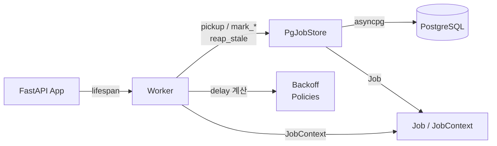
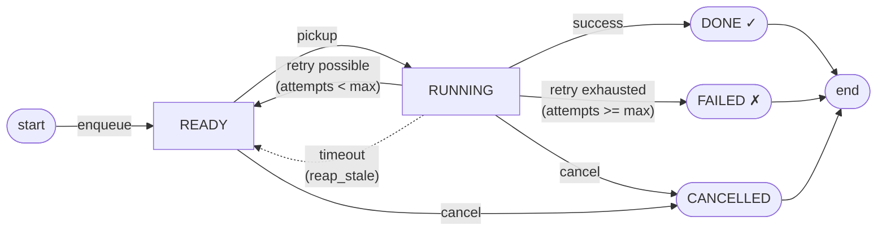
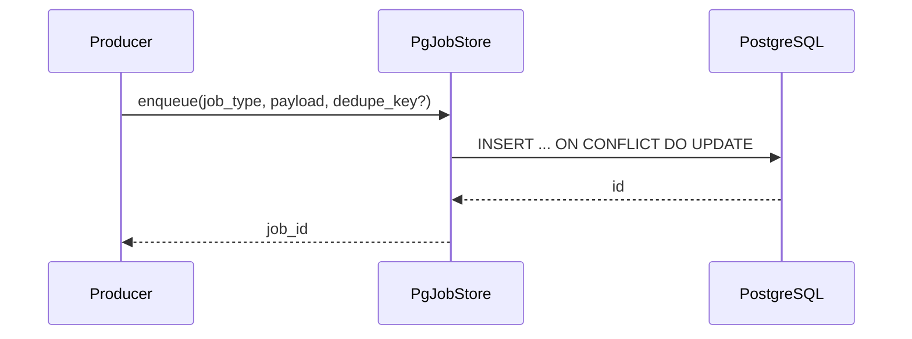
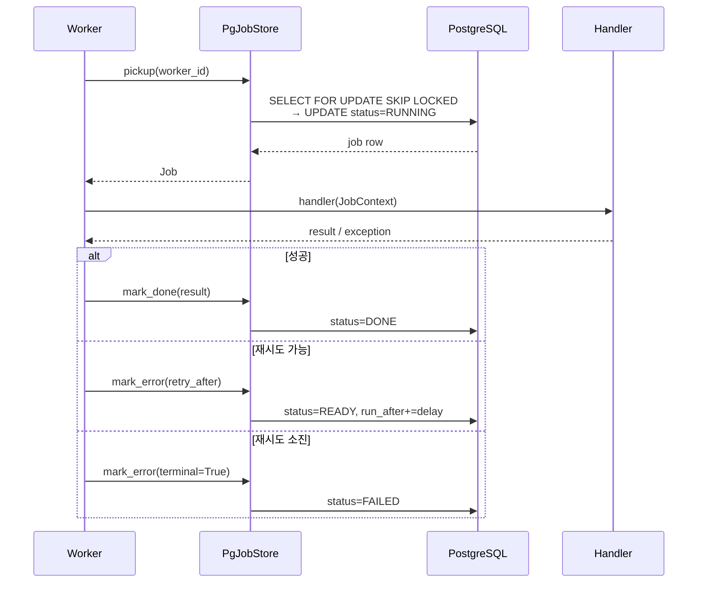
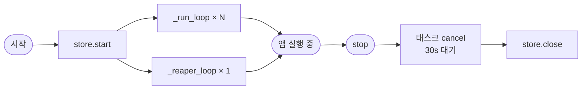
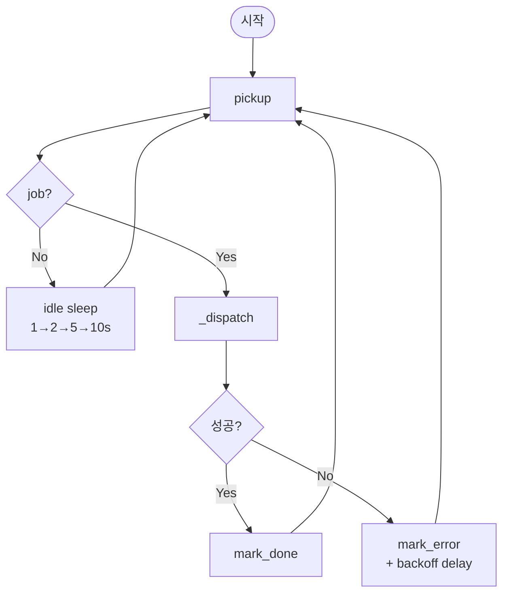
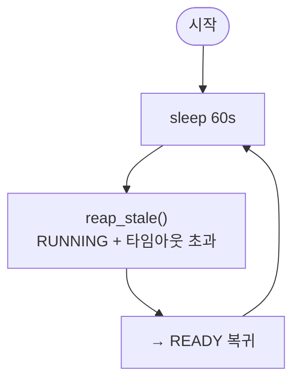
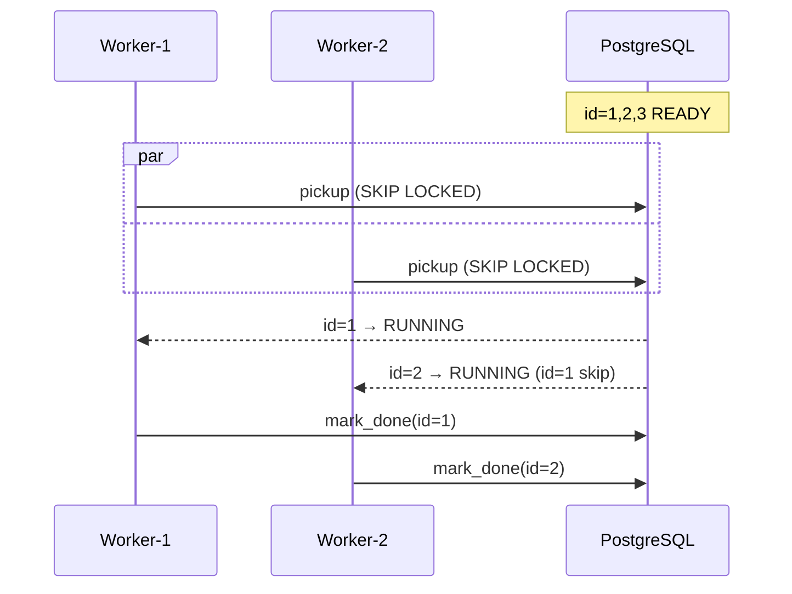

# Architecture & Data Flow

PostgreSQL 하나만으로 동작하는 **async Python 잡 큐** 라이브러리.
FastAPI `lifespan`에 붙여 쓰는 것을 주요 패턴으로 설계되었으며, 별도의 Redis/RabbitMQ 등 추가 인프라가 필요 없다.

---

## 1. 패키지 구조

```
src/pqrun/
├── __init__.py        # 공개 API 노출 (re-export)
├── models.py          # 데이터 모델 (Job, JobContext, Handler 타입)
├── store_asyncpg.py   # DB 연산 레이어 (PgJobStore)
├── worker.py          # 잡 소비 루프 (Worker)
├── backoff.py         # 재시도/폴링 정책
└── ddl.sql            # DB 스키마 (jobs 테이블 + 인덱스)
```

---

## 2. 컴포넌트 관계

각 컴포넌트의 역할과 의존 방향을 나타낸다.



---

## 3. job lifecycle



---

## 4. job enqueue

`dedupe_key`가 있으면 READY/RUNNING 중 중복 삽입을 DB 레벨에서 방지한다.



---

## 5. job execution (pickup → handler → complete)



---

## 6. worker loop structure

### 6-1. lifespan



### 6-2. _run_loop



### 6-3. _reaper_loop



---

## 7. multi-worker concurrency (SKIP LOCKED)



---

## 8. jobs 테이블 주요 컬럼

| 컬럼 | 타입 | 역할 |
|---|---|---|
| `job_type` | text | 핸들러 라우팅 키 |
| `payload` | jsonb | 입력 데이터 |
| `status` | job_status | 상태 머신 |
| `priority` | int | 높을수록 먼저 실행 |
| `run_after` | timestamptz | 실행 가능 최소 시각 (지연/재시도) |
| `dedupe_key` | text | READY/RUNNING 중 유일 (중복 방지) |
| `locked_by` / `locked_at` | text / timestamptz | 현재 점유 중인 워커 |
| `attempts` / `max_attempts` | int | 재시도 카운터 |
| `last_error` | text | 마지막 실패 traceback |
| `result` | jsonb | 핸들러 반환값 |
| `duration_ms` | int | 실행 소요 시간 |

---

## 9. 주요 설계 결정

| 결정 | 이유 |
|---|---|
| `FOR UPDATE SKIP LOCKED` | 워커 간 경쟁 없이 원자적 픽업 보장 |
| `ON CONFLICT DO UPDATE` | DB 레벨 dedupe — 애플리케이션 코드 불필요 |
| `attempts >= max_attempts` 체크를 DB에서 | 워커 재시작 등 경쟁 상황에서도 정확한 카운트 |
| asyncpg (ORM 없음) | 바이너리 프로토콜, asyncio 네이티브, 의존성 최소화 |
| Pool 외부 주입 지원 | FastAPI 앱과 커넥션 풀 공유 가능 |
| reaper loop 분리 | 워커 크래시로 인한 좀비 잡을 별도 루프에서 복구 |
